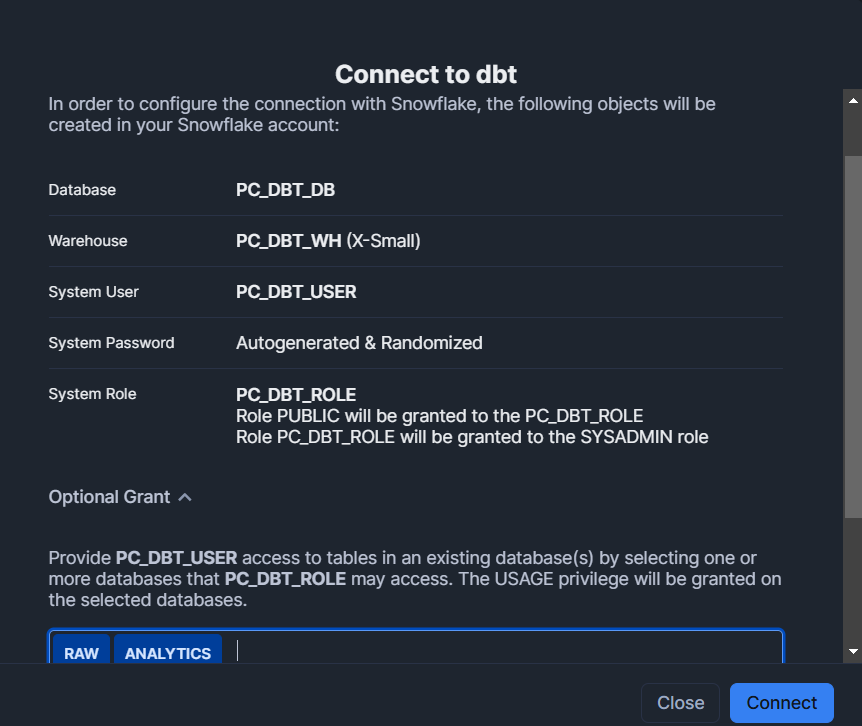

# Snowflake_DBT
Repository setting up snowflake and DBT for DEMO on data engineering practice.

## Tasks
### Setup
- [x] Setup Snowflake
    - Many questions that were targetted towards business users rather than experimenting / setting up a demo or test project.
- [x] Setup DBT Cloud
    - Attempting to follow linked guide for this and additional steps using provided [link](https://docs.getdbt.com/guides/snowflake?step=1)'
    - Picked 'Enterprise' when setting up snowflake - this a requirement for the dbt-snowflake setup guide (to have ACCOUNTADMIN role), so that wa slucky :D

### Load Data
- [x] Find an interesting dataset (something fun to present and nice to model) - scowering Snowflake Marketplace and kaggle, found following free datasets of interest:
    - US Real Estate (By Snowflake Data)
    - US Crime (By Snowflake Data)
    - US Healthcare & Insurance (By Snowflake Data)
    - Travel Pricing & Availability (Vertical Knowledge)
    - [Airplane Crashes Since 1908](https://www.kaggle.com/datasets/saurograndi/airplane-crashes-since-1908/data) or [API - 20 requests / hour](https://rapidapi.com/Berthje/api/flight-accidents-api-ntsb1) or [Directly from NTSB](https://www.ntsb.gov/safety/data/Pages/Data_Stats.aspx)
- [x] Load data into Snowflake
    - Go back to this [guide](https://docs.getdbt.com/guides/snowflake?step=3)
    - Ended up loading [this data](https://www.kaggle.com/datasets/saurograndi/airplane-crashes-since-1908?resource=download) by downloading and uploading into a table 'crashes_and_fatalities' under raw.flight_crashes database. 
- [x] Possibly find additional supporting datasets
    - [ ] Data on plane types / manufacturers (f.ex. boeing has generally seen a lot of crashes, if we had some info on them it would be interesting)
    - [ ] Data on terrain of locations (or simply "difficulty raitings" of certain landings / takeoffs at certain airports)
    - [x] Data on airports: [from here](https://www.kaggle.com/datasets/mexwell/world-airports)
    - [ ] Data on operators (i.e. to use for modelling if they are f.ex. low-budget)
    - [x] Data on flights in general from Snowflake Marketplace[Cirium: Flight Data](https://app.snowflake.com/marketplace/listing/GZTSZRFHVT3/cirium-cirium-flight-data?search=flights)

### Data Model Design
- [ ] Design Data Model (Layer architecture, Data maturity etc.)
    - Enrich data 
        - fetch something from descriptions classifying "type" of crash???
        - fetch country from location??
        - split routes into source and destination
    - Index by Date??
- [x] Create Resources
    - Analytics Layer
    - DBT cloud over github repo
    
    [managed git repo](https://am966.us1.dbt.com/settings/accounts/70471823416715/pages/projects/70471823419437/repositories/70471823404854)

### Transform Data
- [x] Use DBT to transform data (tables, views, load modes)
    - Where is the terminal? XD (took a few minutes to see it was in the bottom, ahaha)
    - Even though i set the target database to analytics, it is still materialising in PC_DBT_DB??? -> specified in db-project.yml, but grant issue -> granted acces to role on dbs.
    - Error: *None: Failed to connect to DB: JE24291.west-europe.azure.snowflakecomputing.com:443. Incorrect username or password was specified. 22:15:58 Snowflake adapter: Got a retryable error when attempting to open a snowflake connection. 2 attempts remaining. Retrying in 30 seconds Error: 250001 (08001): None: Failed to connect to DB: JE24291.west-europe.azure.snowflakecomputing.com:443. Your user account has been temporarily locked due to too many failed attempts. Try again after 15 minutes or contact your account administrator for assistance. For more information about this error, go to https://community.snowflake.com/s/error-your-user-login-has-been-locked.* - I reset the password for the svc user when setting up the production deployment environment as i did not previously have it, had not updated it in my personal settings which were used when running in DEV and therefore locked the SVC user.
- [x] Add relevant data tests
    - not null for most things, unique for a few things?
    - accepted values for types
- [x] Add documentation of models
    - describe tables and columns
- [x] Setup Job
    - Encountered error "No active warehouse selected in the current session." for a while - turns out the issue was a grant issue, as the role just didn't have permission to access the 'transforming' warehouse we created.

### Prod. Architecture
- [ ] Consider design for scalability and robustness: 
    - [ ] data pipelines,
    - [ ] multiple developers / users,
    - [ ] concurrent workflows

### Prepare presentation (PPT + Code Snippets)
- [ ] Thought process
- [ ] Difficulties / Challengess
    - Open-Ended Task; when have I done enough, what do I need to show I can do, what is too easy / hard? -> in this regard also imposter syndrome
    - Familiarity with concepts (dbt, data layers etc.) but new tools and new ways-of-working
- [ ] "If I had had more time..."
    - more data:
        - country / location dim (possibly with geographical information) + date dim
        - Manufacturer information / Airport information